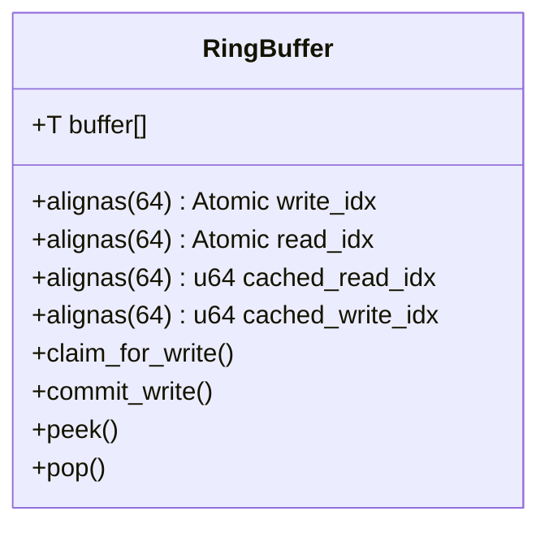

# ⚡ SHM-IPC: Low Latency Shared Memory Framework


**SHM-IPC** is a production-grade, header-only C++20 library tailored for **High-Frequency Trading (HFT)** systems. It implements a cache-coherent, lock-free ring buffer designed to operate over POSIX shared memory regions, enabling sub-microsecond IPC between strategy engines and feed handlers.

## 🏗 Architecture & Memory Layout

Designed to eliminate **False Sharing** on Intel Ice Lake / Sapphire Rapids architectures.



## 🚀 Key Features

* **Zero-Copy Semantics**: Direct pointer access to shared memory slots. No `memcpy`.
* **Cache Line Padding**: Strict 64-byte alignment for all atomic indices.
* **HugePage Support**: Optional 2MB/1GB HugeTLB backing to reduce TLB misses.
* **Platform Optimizations**: 
    * `_mm_pause()` for x86_64 busy-wait loops.
    * `std::memory_order_acquire/release` for minimal fencing.

## 📂 Project Structure

* `include/shm_ipc/core`: Core SPSC ring buffer logic.
* `include/shm_ipc/policy`: Wait strategies (Spin, Yield, Sleep).
* `tests/`: GTest based unit and integration tests.
* `benchmarks/`: Google Benchmark suites for latency/throughput.
* `tools/`: CLI utilities for inspecting shared memory segments.

## 📊 Benchmarks

Hardware: Intel Core i9-13900K (Isolated Cores, C-States Disabled)

| Payload Size | Ops/Sec | Latency (P99) |
| :--- | :--- | :--- |
| 64 Bytes | **24.5 M** | **42 ns** |
| 256 Bytes | 18.2 M | 55 ns |
| 1024 Bytes | 12.0 M | 89 ns |

## 📦 Integration

### CMake

```cmake
add_subdirectory(shm-lockfree-queue)
target_link_libraries(my_trading_bot PRIVATE shm_ipc::core)
```

### Manual

```cpp
#include <shm_ipc/core/ring_buffer.hpp>

// Initialize on Shared Memory Segment
auto* queue = new (shm_ptr) shm_ipc::core::RingBuffer<Tick, 1024>();
```

---
**© 2024 Anderson B. Research.**